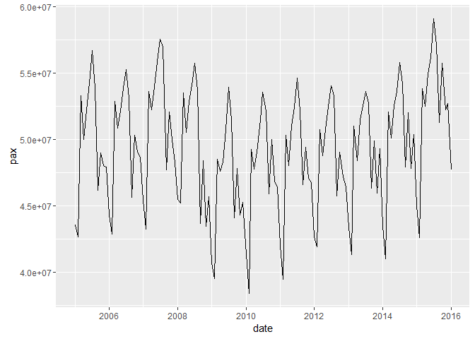
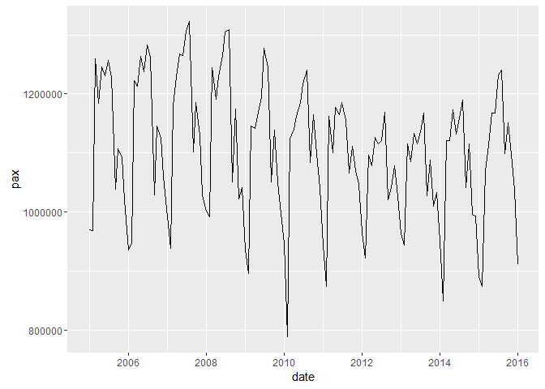
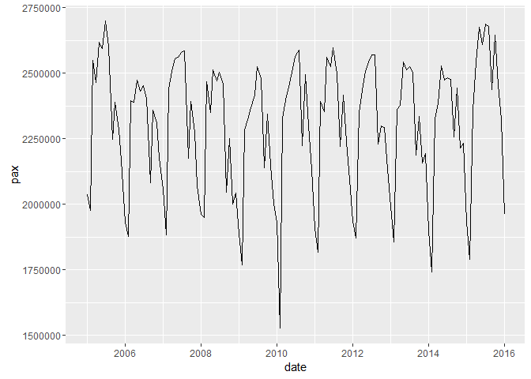
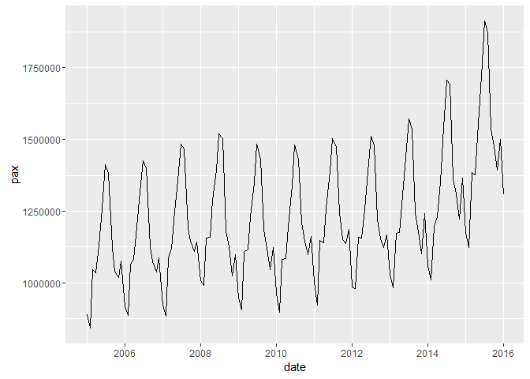
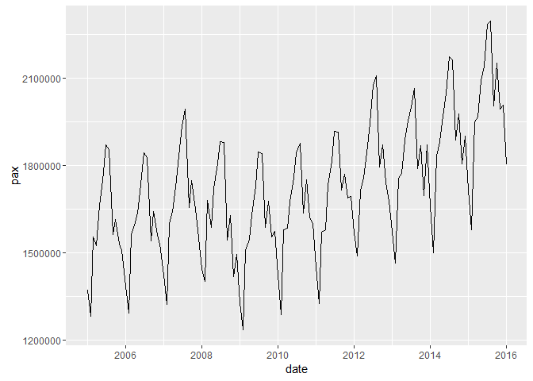
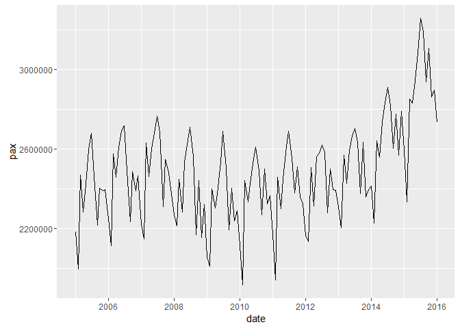
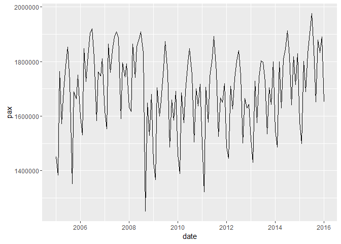
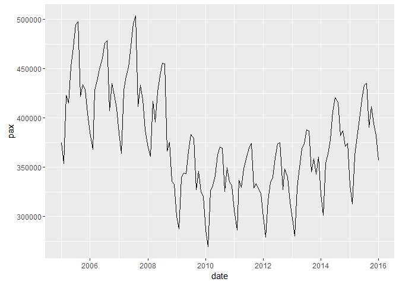
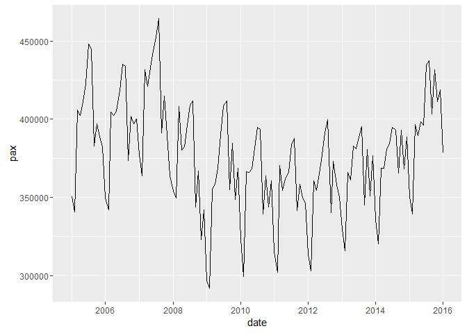

# Untitled
Tourism Economics  
April 15, 2016  


```r
# load certain meta data
ffile <- c("~/Project/R projects/bts_2016/input_data/T100_D_MARKET_US_CARRIER_ONLY_META")
l_airport_id <- read_csv(paste0(ffile, "/", "L_AIRPORT_ID.csv"), col_names=TRUE)
colnames(l_airport_id) <- tolower(colnames(l_airport_id))

ffile <- c("~/Project/R projects/bts_2016/input_data/T100_D_MARKET_US_CARRIER_ONLY_META")
l_city_market_id <- read_csv(paste0(ffile, "/", "L_CITY_MARKET_ID.csv"), col_names=TRUE)
colnames(l_city_market_id) <- tolower(colnames(l_city_market_id))

# load manual crosswalk
# the dest_city_market_id column is the part that is stable. The names can change. So use the
# codes for lookups.
ffile <- c("~/Project/R projects/bts_2016/input_data/")
manual_cw_from_bts_cityid <- read_csv(paste0(ffile, "/", "manual_cw_from_bts_cityid.csv"), col_names=TRUE)

# load census metro list from fred
ffile <- c("~/Project/R projects/bts_2016/input_data/")
m_cen <- read_csv(paste0(ffile, "/", "m_cen.csv"), col_names=TRUE)

# load data
load("~/Project/R projects/bts_2016/output_data/t100d_uscar.Rdata")
```


Generate a list of cities, which was useful for creating a manual crosswalk.

```r
city_by_volume <- data_work %>%
  filter(year == 2015) %>%
  group_by(dest_city_market_id, dest_city_name) %>%
  summarise(pax = sum(pax)) %>%
  ungroup() %>%
  arrange(desc(pax))
kable(head(city_by_volume,50))
```


 dest_city_market_id  dest_city_name                                pax
--------------------  --------------------------------------  ---------
               30397  Atlanta, GA (Metropolitan Area)          43975972
               30977  Chicago, IL                              41062643
               31703  New York City, NY (Metropolitan Area)    40950268
               32575  Los Angeles, CA (Metropolitan Area)      36524512
               30194  Dallas/Fort Worth, TX                    34897635
               30852  Washington, DC (Metropolitan Area)       29133441
               32457  San Francisco, CA (Metropolitan Area)    28835939
               30325  Denver, CO                               25175751
               31453  Houston, TX                              21374845
               32467  Miami, FL (Metropolitan Area)            21016097
               30466  Phoenix, AZ                              20888193
               31057  Charlotte, NC                            20484775
               32211  Las Vegas, NV                            19954382
               30559  Seattle, WA                              18025401
               30721  Boston, MA (Metropolitan Area)           16627973
               31650  Minneapolis/St. Paul, MN                 16421712
               31454  Orlando, FL                              16412480
               31295  Detroit, MI                              14640678
               34100  Philadelphia, PA                         13137656
               34614  Salt Lake City, UT                       10326814
               33570  San Diego, CA                             9620011
               33195  Tampa, FL (Metropolitan Area)             9618323
               34057  Portland, OR                              8045927
               32134  Honolulu, HI                              7023637
               31123  St. Louis, MO                             6162021
               30693  Nashville, TN                             5677337
               30423  Austin, TX                                5641528
               33495  New Orleans, LA                           5283368
               33198  Kansas City, MO                           5109539
               34492  Raleigh/Durham, NC                        4827827
               33192  Sacramento, CA                            4607734
               30647  Cleveland, OH (Metropolitan Area)         4595367
               31714  Fort Myers, FL                            3946147
               33214  San Antonio, TX                           3859039
               32337  Indianapolis, IN                          3849532
               30198  Pittsburgh, PA                            3827362
               34819  San Juan, PR                              3690824
               31066  Columbus, OH                              3372555
               33342  Milwaukee, WI                             3168566
               33830  Kahului, HI                               3052000
               34027  West Palm Beach/Palm Beach, FL            3038192
               33105  Cincinnati, OH                            2941711
               30529  Hartford, CT                              2892605
               31136  Jacksonville, FL                          2707248
               30299  Anchorage, AK                             2475772
               30792  Buffalo, NY                               2331711
               30140  Albuquerque, NM                           2322378
               33316  Omaha, NE                                 2045247
               33244  Memphis, TN                               1871418
               33851  Oklahoma City, OK                         1803695

```r
write.csv(city_by_volume, "~/Project/R projects/bts_2016/output_data/city_by_volume.csv", row.names=FALSE)
```


# Experimenting a bit with Atlanta

```r
temp1 <- data_work %>%
  filter(unique_carrier == "DL") %>%
  group_by(dest_airport_name, year, month) %>%
  summarise(pax = sum(pax))

atlanta <- temp1 %>%
  filter(year == 2014) %>%
  filter(dest_airport_name == "Atlanta, GA: Hartsfield-Jackson Atlanta International")

kable(atlanta)
```


dest_airport_name                                        year   month       pax
------------------------------------------------------  -----  ------  --------
Atlanta, GA: Hartsfield-Jackson Atlanta International    2014       1   2053187
Atlanta, GA: Hartsfield-Jackson Atlanta International    2014       2   1967068
Atlanta, GA: Hartsfield-Jackson Atlanta International    2014       3   2614293
Atlanta, GA: Hartsfield-Jackson Atlanta International    2014       4   2576351
Atlanta, GA: Hartsfield-Jackson Atlanta International    2014       5   2706025
Atlanta, GA: Hartsfield-Jackson Atlanta International    2014       6   2683924
Atlanta, GA: Hartsfield-Jackson Atlanta International    2014       7   2774533
Atlanta, GA: Hartsfield-Jackson Atlanta International    2014       8   2702576
Atlanta, GA: Hartsfield-Jackson Atlanta International    2014       9   2520334
Atlanta, GA: Hartsfield-Jackson Atlanta International    2014      10   2764755
Atlanta, GA: Hartsfield-Jackson Atlanta International    2014      11   2540725
Atlanta, GA: Hartsfield-Jackson Atlanta International    2014      12   2457492

For December 2014, I keep getting 2,457,492. Same as Excel, and different from the web page which shows
2,456,412.


```r
atlanta <- data_work %>%
  filter(dest_airport_id == 10397) %>%
  filter(unique_carrier == "DL") %>%
  group_by(year, month) %>%
  summarise(pax = sum(pax))

kable(tail(atlanta, 18))
```


 year   month       pax
-----  ------  --------
 2014       8   2702576
 2014       9   2520334
 2014      10   2764755
 2014      11   2540725
 2014      12   2457492
 2015       1   2294434
 2015       2   2207091
 2015       3   2787127
 2015       4   2702444
 2015       5   2841632
 2015       6   2850231
 2015       7   2923465
 2015       8   2837871
 2015       9   2655697
 2015      10   2908371
 2015      11   2745606
 2015      12   2558011
 2016       1   2426889


```r
atlanta <- data_work %>%
  filter(dest_city_market_id == 30397) %>%
  filter(unique_carrier == "DL") %>%
  group_by(year, month) %>%
  summarise(pax = sum(pax))

kable(tail(atlanta, 18))
```


 year   month       pax
-----  ------  --------
 2014       8   2702576
 2014       9   2520334
 2014      10   2764755
 2014      11   2540725
 2014      12   2457492
 2015       1   2294434
 2015       2   2207091
 2015       3   2787127
 2015       4   2702444
 2015       5   2841632
 2015       6   2850231
 2015       7   2923465
 2015       8   2837871
 2015       9   2655697
 2015      10   2908371
 2015      11   2745606
 2015      12   2558011
 2016       1   2426889


```r
data_1 <- data_work %>%
  group_by(dest_city_market_id, dest_city_name, year, month) %>%
  summarise(pax = sum(pax))

atlanta <- data_1 %>%
  filter(year == 2015) %>%
  filter(dest_city_name == "Atlanta, GA (Metropolitan Area)")

kable(atlanta)
```


 dest_city_market_id  dest_city_name                     year   month       pax
--------------------  --------------------------------  -----  ------  --------
               30397  Atlanta, GA (Metropolitan Area)    2015       1   3093203
               30397  Atlanta, GA (Metropolitan Area)    2015       2   2953846
               30397  Atlanta, GA (Metropolitan Area)    2015       3   3744268
               30397  Atlanta, GA (Metropolitan Area)    2015       4   3652802
               30397  Atlanta, GA (Metropolitan Area)    2015       5   3846763
               30397  Atlanta, GA (Metropolitan Area)    2015       6   3889339
               30397  Atlanta, GA (Metropolitan Area)    2015       7   4019727
               30397  Atlanta, GA (Metropolitan Area)    2015       8   3871315
               30397  Atlanta, GA (Metropolitan Area)    2015       9   3640542
               30397  Atlanta, GA (Metropolitan Area)    2015      10   3972827
               30397  Atlanta, GA (Metropolitan Area)    2015      11   3716030
               30397  Atlanta, GA (Metropolitan Area)    2015      12   3575310

Use the manual crosswalk. For those areas that have an area_name_simp, see which airports fall into that area, while also seeing how the dest_city_names relate.

```r
temp3 <- data_work %>%
  filter(! is.na(area_name_simp)) 

air_by_area_simp  <- distinct(select(temp3, dest_city_name, area_name_simp, dest_airport_name)) %>%
  arrange(dest_city_name, area_name_simp, dest_airport_name)

kable(air_by_area_simp)
```


dest_city_name                          area_name_simp       dest_airport_name                                                      
--------------------------------------  -------------------  -----------------------------------------------------------------------
Albany, NY                              Albany, NY           Albany, NY: Albany International                                       
Albuquerque, NM                         Albuquerque, NM      Albuquerque, NM: Albuquerque International Sunport                     
Albuquerque, NM                         Albuquerque, NM      Albuquerque, NM: Double Eagle II                                       
Anchorage, AK                           Anchorage, AK        Anchorage, AK: Elmendorf AFB                                           
Anchorage, AK                           Anchorage, AK        Anchorage, AK: Lake Hood Strip                                         
Anchorage, AK                           Anchorage, AK        Anchorage, AK: Merrill Field                                           
Anchorage, AK                           Anchorage, AK        Anchorage, AK: Ted Stevens Anchorage International                     
Atlanta, GA (Metropolitan Area)         Atlanta, GA          Atlanta, GA: Dekalb Peachtree                                          
Atlanta, GA (Metropolitan Area)         Atlanta, GA          Atlanta, GA: Fulton County Airport-Brown Field                         
Atlanta, GA (Metropolitan Area)         Atlanta, GA          Atlanta, GA: Hartsfield-Jackson Atlanta International                  
Atlanta, GA (Metropolitan Area)         Atlanta, GA          Kennesaw, GA: Cobb County International McCollum Field                 
Austin, TX                              Austin, TX           Austin, TX: Austin - Bergstrom International                           
Austin, TX                              Austin, TX           Horseshoe Bay, TX: Horseshoe Bay Resort                                
Birmingham, AL                          Birmingham, AL       Birmingham, AL: Birmingham-Shuttlesworth International                 
Bloomington/Normal, IL                  Bloomington, IL      Bloomington/Normal, IL: Central Illinois Regional                      
Boston, MA (Metropolitan Area)          Boston, MA           Boston, MA: Logan International                                        
Boston, MA (Metropolitan Area)          Boston, MA           Manchester, NH: Manchester-Boston Regional                             
Boston, MA (Metropolitan Area)          Boston, MA           Providence, RI: Theodore Francis Green State                           
Buffalo, NY                             Buffalo, NY          Buffalo, NY: Buffalo Niagara International                             
Charleston, SC                          Charleston, SC       Charleston, SC: Charleston AFB/International                           
Charlotte, NC                           Charlotte, NC        Charlotte, NC: Charlotte Douglas International                         
Chicago, IL                             Chicago, IL          Chicago, IL: Chicago Executive                                         
Chicago, IL                             Chicago, IL          Chicago, IL: Chicago Midway International                              
Chicago, IL                             Chicago, IL          Chicago, IL: Chicago O'Hare International                              
Chicago, IL                             Chicago, IL          Chicago, IL: Du Page County                                            
Chicago, IL                             Chicago, IL          Chicago/Romeoville, IL: Lewis University                               
Chicago, IL                             Chicago, IL          Gary, IN: Gary/Chicago International                                   
Cincinnati, OH                          Cincinnati, OH       Cincinnati, OH: Cincinnati - Blue Ash                                  
Cincinnati, OH                          Cincinnati, OH       Cincinnati, OH: Cincinnati Municipal Lunken Field                      
Cincinnati, OH                          Cincinnati, OH       Cincinnati, OH: Cincinnati/Northern Kentucky International             
Cleveland, OH (Metropolitan Area)       Cleveland, OH        Akron, OH: Akron-Canton Regional                                       
Cleveland, OH (Metropolitan Area)       Cleveland, OH        Akron, OH: Akron Fulton International                                  
Cleveland, OH (Metropolitan Area)       Cleveland, OH        Cleveland, OH: Burke Lakefront                                         
Cleveland, OH (Metropolitan Area)       Cleveland, OH        Cleveland, OH: Cleveland-Hopkins International                         
Cleveland, OH (Metropolitan Area)       Cleveland, OH        Cleveland, OH: Cuyahoga County                                         
Columbus, OH                            Columbus, OH         Columbus, OH: Ohio State University                                    
Columbus, OH                            Columbus, OH         Columbus, OH: Port Columbus International                              
Columbus, OH                            Columbus, OH         Columbus, OH: Rickenbacker International                               
Dallas/Fort Worth, TX                   Dallas, TX           Dallas, TX: Addison                                                    
Dallas/Fort Worth, TX                   Dallas, TX           Dallas, TX: Dallas Love Field                                          
Dallas/Fort Worth, TX                   Dallas, TX           Dallas/Fort Worth, TX: Dallas Executive                                
Dallas/Fort Worth, TX                   Dallas, TX           Dallas/Fort Worth, TX: Dallas North                                    
Dallas/Fort Worth, TX                   Dallas, TX           Dallas/Fort Worth, TX: Dallas/Fort Worth International                 
Dallas/Fort Worth, TX                   Dallas, TX           Dallas/Fort Worth, TX: Fort Worth Alliance                             
Dallas/Fort Worth, TX                   Dallas, TX           Dallas/Fort Worth, TX: Fort Worth Meacham International                
Dallas/Fort Worth, TX                   Dallas, TX           Fort Worth, TX: Fort Worth NAS JRB/Carswell Field                      
Dallas/Fort Worth, TX                   Dallas, TX           Fort Worth, TX: Fort Worth Spinks                                      
Dayton, OH                              Dayton, OH           Dayton, OH: Dayton-Wright Brothers                                     
Dayton, OH                              Dayton, OH           Dayton, OH: James M Cox/Dayton International                           
Dayton, OH                              Dayton, OH           Dayton, OH: Wright-Patterson AFB                                       
Denver, CO                              Denver, CO           Aurora, CO: Buckley AFB                                                
Denver, CO                              Denver, CO           Denver, CO: Centennial                                                 
Denver, CO                              Denver, CO           Denver, CO: Denver International                                       
Denver, CO                              Denver, CO           Denver, CO: Front Range                                                
Des Moines, IA                          Des Moines, IA       Des Moines, IA: Des Moines International                               
Detroit, MI                             Detroit, MI          Detroit, MI: Coleman A. Young Municipal                                
Detroit, MI                             Detroit, MI          Detroit, MI: Detroit Metro Wayne County                                
Detroit, MI                             Detroit, MI          Detroit, MI: Willow Run                                                
El Paso, TX                             El Paso, TX          El Paso, TX: Biggs AAF                                                 
El Paso, TX                             El Paso, TX          El Paso, TX: El Paso International                                     
Grand Rapids, MI                        Grand Rapids, MI     Grand Rapids, MI: Gerald R. Ford International                         
Hartford, CT                            Hartford, CT         Hartford, CT: Bradley International                                    
Hartford, CT                            Hartford, CT         Hartford, CT: Hartford Brainard                                        
Honolulu, HI                            Honolulu, HI         Honolulu, HI: Honolulu International                                   
Honolulu, HI                            Honolulu, HI         Honolulu, HI: Joint Base Pearl Harbor-Hickam                           
Houston, TX                             Houston, TX          Houston, TX: David Wayne Hooks Memorial                                
Houston, TX                             Houston, TX          Houston, TX: Ellington                                                 
Houston, TX                             Houston, TX          Houston, TX: George Bush Intercontinental/Houston                      
Houston, TX                             Houston, TX          Houston, TX: Houston Central Business District Heliport                
Houston, TX                             Houston, TX          Houston, TX: West Houston                                              
Houston, TX                             Houston, TX          Houston, TX: William P Hobby                                           
Indianapolis, IN                        Indianapolis, IN     Indianapolis, IN: Eagle Creek Airpark                                  
Indianapolis, IN                        Indianapolis, IN     Indianapolis, IN: Indianapolis Executive                               
Indianapolis, IN                        Indianapolis, IN     Indianapolis, IN: Indianapolis International                           
Indianapolis, IN                        Indianapolis, IN     Indianapolis, IN: Indianapolis Metro                                   
Indianapolis, IN                        Indianapolis, IN     Indianapolis, IN: Indianapolis Regional                                
Jacksonville, FL                        Jacksonville, FL     Jacksonville, FL: Cecil                                                
Jacksonville, FL                        Jacksonville, FL     Jacksonville, FL: Jacksonville Executive at Craig                      
Jacksonville, FL                        Jacksonville, FL     Jacksonville, FL: Jacksonville International                           
Jacksonville, FL                        Jacksonville, FL     Jacksonville, FL: Jacksonville NAS                                     
Kahului, HI                             Kahului, HI          Kahului, HI: Kahului Airport                                           
Kansas City, MO                         Kansas City, MO      Kansas City, MO: Charles B. Wheeler Downtown                           
Kansas City, MO                         Kansas City, MO      Kansas City, MO: Kansas City International                             
Kansas City, MO                         Kansas City, MO      Olathe, KS: Johnson County Executive                                   
Kansas City, MO                         Kansas City, MO      Olathe, KS: New Century Aircenter                                      
Las Vegas, NV                           Las Vegas, NV        Las Vegas, NV: Henderson Executive                                     
Las Vegas, NV                           Las Vegas, NV        Las Vegas, NV: McCarran International                                  
Las Vegas, NV                           Las Vegas, NV        Las Vegas, NV: Nellis AFB                                              
Las Vegas, NV                           Las Vegas, NV        Las Vegas, NV: North Las Vegas                                         
Los Angeles, CA (Metropolitan Area)     Los Angeles, CA      Burbank, CA: Bob Hope                                                  
Los Angeles, CA (Metropolitan Area)     Los Angeles, CA      Hawthorne, CA: Jack Northrop Field/Hawthorne Municipal                 
Los Angeles, CA (Metropolitan Area)     Los Angeles, CA      Long Beach, CA: Long Beach Airport                                     
Los Angeles, CA (Metropolitan Area)     Los Angeles, CA      Los Angeles, CA: Los Angeles International                             
Los Angeles, CA (Metropolitan Area)     Los Angeles, CA      Ontario, CA: Ontario International                                     
Los Angeles, CA (Metropolitan Area)     Los Angeles, CA      Santa Ana, CA: John Wayne Airport-Orange County                        
Los Angeles, CA (Metropolitan Area)     Los Angeles, CA      Santa Monica, CA: Santa Monica Municipal                               
Los Angeles, CA (Metropolitan Area)     Los Angeles, CA      Van Nuys, CA: Van Nuys Airport                                         
Louisville, KY                          Louisville, KY       Louisville, KY: Bowman Field                                           
Louisville, KY                          Louisville, KY       Louisville, KY: Louisville International-Standiford Field              
Memphis, TN                             Memphis, TN          Memphis, TN: Memphis International                                     
Memphis, TN                             Memphis, TN          Millington, TN: Millington Regional Jetport                            
Miami, FL (Metropolitan Area)           Miami, FL            Fort Lauderdale, FL: Fort Lauderdale-Hollywood International           
Miami, FL (Metropolitan Area)           Miami, FL            Fort Lauderdale, FL: Fort Lauderdale Executive                         
Miami, FL (Metropolitan Area)           Miami, FL            Miami, FL: Dade-Collier Training and Transition                        
Miami, FL (Metropolitan Area)           Miami, FL            Miami, FL: Miami Executive                                             
Miami, FL (Metropolitan Area)           Miami, FL            Miami, FL: Miami International                                         
Miami, FL (Metropolitan Area)           Miami, FL            Miami, FL: Opa-locka Executive                                         
Miami, FL (Metropolitan Area)           Miami, FL            Miami, FL: Watson Island International                                 
Milwaukee, WI                           Milwaukee, WI        Milwaukee, WI: General Mitchell International                          
Milwaukee, WI                           Milwaukee, WI        Milwaukee, WI: Lawrence J Timmerman                                    
Minneapolis/St. Paul, MN                Minneapolis, MN      Minneapolis, MN: Flying Cloud                                          
Minneapolis/St. Paul, MN                Minneapolis, MN      Minneapolis, MN: Minneapolis-St Paul International                     
Minneapolis/St. Paul, MN                Minneapolis, MN      Minneapolis/St. Paul, MN: St. Paul Downtown Holman Field               
Nashville, TN                           Nashville, TN        Nashville, TN: John C Tune                                             
Nashville, TN                           Nashville, TN        Nashville, TN: Nashville International                                 
New Orleans, LA                         New Orleans, LA      New Orleans, LA: Lakefront                                             
New Orleans, LA                         New Orleans, LA      New Orleans, LA: Louis Armstrong New Orleans International             
New Orleans, LA                         New Orleans, LA      New Orleans, LA: New Orleans NAS JRB                                   
New York City, NY (Metropolitan Area)   New York, NY         Islip, NY: Long Island MacArthur                                       
New York City, NY (Metropolitan Area)   New York, NY         New York, NY: Downtown Manhattan/Wall Street Heliport                  
New York City, NY (Metropolitan Area)   New York, NY         New York, NY: East 34th Street Heliport                                
New York City, NY (Metropolitan Area)   New York, NY         New York, NY: John F. Kennedy International                            
New York City, NY (Metropolitan Area)   New York, NY         New York, NY: LaGuardia                                                
New York City, NY (Metropolitan Area)   New York, NY         New York, NY: West 30th Street Heliport                                
New York City, NY (Metropolitan Area)   New York, NY         Newark, NJ: Newark Liberty International                               
New York City, NY (Metropolitan Area)   New York, NY         Newburgh/Poughkeepsie, NY: Stewart International                       
New York City, NY (Metropolitan Area)   New York, NY         White Plains, NY: Westchester County                                   
Norfolk, VA (Metropolitan Area)         Virginia Beach, VA   Newport News/Hampton, VA: Langley AFB                                  
Norfolk, VA (Metropolitan Area)         Virginia Beach, VA   Newport News/Williamsburg, VA: Newport News/Williamsburg International 
Norfolk, VA (Metropolitan Area)         Virginia Beach, VA   Norfolk, VA: Norfolk International                                     
Norfolk, VA (Metropolitan Area)         Virginia Beach, VA   Norfolk, VA: Norfolk NS                                                
Norfolk, VA (Metropolitan Area)         Virginia Beach, VA   Williamsburg, VA: Williamsburg-Jamestown                               
Oklahoma City, OK                       Oklahoma City, OK    Oklahoma City, OK: Tinker AFB                                          
Oklahoma City, OK                       Oklahoma City, OK    Oklahoma City, OK: Wiley Post                                          
Oklahoma City, OK                       Oklahoma City, OK    Oklahoma City, OK: Will Rogers World                                   
Omaha, NE                               Omaha, NE            Omaha, NE: Eppley Airfield                                             
Omaha, NE                               Omaha, NE            Omaha, NE: Offutt AFB                                                  
Orlando, FL                             Orlando, FL          Orlando, FL: Executive                                                 
Orlando, FL                             Orlando, FL          Orlando, FL: Kissimmee Gateway                                         
Orlando, FL                             Orlando, FL          Orlando, FL: Orlando International                                     
Philadelphia, PA                        Philadelphia, PA     Philadelphia, PA: Northeast Philadelphia                               
Philadelphia, PA                        Philadelphia, PA     Philadelphia, PA: Philadelphia International                           
Phoenix, AZ                             Phoenix, AZ          Glendale, AZ: Glendale Municipal                                       
Phoenix, AZ                             Phoenix, AZ          Goodyear, AZ: Phoenix Goodyear                                         
Phoenix, AZ                             Phoenix, AZ          Phoenix, AZ: Luke AFB                                                  
Phoenix, AZ                             Phoenix, AZ          Phoenix, AZ: Phoenix - Deer Valley                                     
Phoenix, AZ                             Phoenix, AZ          Phoenix, AZ: Phoenix - Mesa Gateway                                    
Phoenix, AZ                             Phoenix, AZ          Phoenix, AZ: Phoenix Sky Harbor International                          
Phoenix, AZ                             Phoenix, AZ          Phoenix, AZ: Scottsdale                                                
Pittsburgh, PA                          Pittsburgh, PA       Pittsburgh, PA: Allegheny County                                       
Pittsburgh, PA                          Pittsburgh, PA       Pittsburgh, PA: Pittsburgh International                               
Portland, OR                            Portland, OR         Portland, OR: Portland International                                   
Raleigh/Durham, NC                      Raleigh, NC          Raleigh/Durham, NC: Raleigh-Durham International                       
Reno, NV                                Reno, NV             Reno, NV: Reno/Tahoe International                                     
Richmond, VA                            Richmond, VA         Richmond, VA: Richmond International                                   
Rochester, NY                           Rochester, NY        Rochester, NY: Greater Rochester International                         
Sacramento, CA                          Sacramento, CA       Sacramento, CA: McClellan Airfield                                     
Sacramento, CA                          Sacramento, CA       Sacramento, CA: Sacramento Executive                                   
Sacramento, CA                          Sacramento, CA       Sacramento, CA: Sacramento International                               
Sacramento, CA                          Sacramento, CA       Sacramento, CA: Sacramento Mather                                      
Salt Lake City, UT                      Salt Lake City, UT   Salt Lake City, UT: Salt Lake City International                       
San Antonio, TX                         San Antonio, TX      San Antonio, TX: Kelly Field                                           
San Antonio, TX                         San Antonio, TX      San Antonio, TX: San Antonio International                             
San Diego, CA                           San Diego, CA        San Diego, CA: Brown Field Municipal                                   
San Diego, CA                           San Diego, CA        San Diego, CA: Gillespie Field                                         
San Diego, CA                           San Diego, CA        San Diego, CA: Miramar MCAS                                            
San Diego, CA                           San Diego, CA        San Diego, CA: Montgomery Field                                        
San Diego, CA                           San Diego, CA        San Diego, CA: North Island NAS                                        
San Diego, CA                           San Diego, CA        San Diego, CA: San Diego International                                 
San Francisco, CA (Metropolitan Area)   San Francisco, CA    Concord, CA: Buchanan Field                                            
San Francisco, CA (Metropolitan Area)   San Francisco, CA    Oakland, CA: Metropolitan Oakland International                        
San Francisco, CA (Metropolitan Area)   San Francisco, CA    San Francisco, CA: China Basin Heliport                                
San Francisco, CA (Metropolitan Area)   San Francisco, CA    San Francisco, CA: San Francisco International                         
San Francisco, CA (Metropolitan Area)   San Francisco, CA    San Jose, CA: Norman Y. Mineta San Jose International                  
Seattle, WA                             Seattle, WA          Kenmore, WA: Kenmore Air Harbor                                        
Seattle, WA                             Seattle, WA          Seattle, WA: Boeing Field/King County International                    
Seattle, WA                             Seattle, WA          Seattle, WA: Lake Union Terminal                                       
Seattle, WA                             Seattle, WA          Seattle, WA: Seattle/Tacoma International                              
Spokane, WA                             Spokane, WA          Spokane, WA: Fairchild AFB                                             
Spokane, WA                             Spokane, WA          Spokane, WA: Felts Field                                               
Spokane, WA                             Spokane, WA          Spokane, WA: Spokane International                                     
St. Louis, MO                           St Louis, MO         Alton, IL: St. Louis Regional                                          
St. Louis, MO                           St Louis, MO         St. Louis, MO: Bi-State Parks                                          
St. Louis, MO                           St Louis, MO         St. Louis, MO: Lambert-St. Louis International                         
St. Louis, MO                           St Louis, MO         St. Louis, MO: Spirit of St. Louis                                     
Tampa, FL (Metropolitan Area)           Tampa, FL            Lakeland, FL: Lakeland Linder Regional                                 
Tampa, FL (Metropolitan Area)           Tampa, FL            St. Petersburg, FL: St Pete Clearwater International                   
Tampa, FL (Metropolitan Area)           Tampa, FL            Tampa, FL: Macdill AFB                                                 
Tampa, FL (Metropolitan Area)           Tampa, FL            Tampa, FL: Tampa International                                         
Tucson, AZ                              Tucson, AZ           Tucson, AZ: Davis Monthan AFB                                          
Tucson, AZ                              Tucson, AZ           Tucson, AZ: Marana Regional                                            
Tucson, AZ                              Tucson, AZ           Tucson, AZ: Tucson International                                       
Tulsa, OK                               Tulsa, OK            Tulsa, OK: Richard Lloyd Jones Jr.                                     
Tulsa, OK                               Tulsa, OK            Tulsa, OK: Tulsa International                                         
Washington, DC (Metropolitan Area)      Washington, DC       Baltimore, MD: Baltimore/Washington International Thurgood Marshall    
Washington, DC (Metropolitan Area)      Washington, DC       Baltimore, MD: Martin State                                            
Washington, DC (Metropolitan Area)      Washington, DC       Washington, DC: Ronald Reagan Washington National                      
Washington, DC (Metropolitan Area)      Washington, DC       Washington, DC: Washington Dulles International                        
West Palm Beach/Palm Beach, FL          Miami, FL            West Palm Beach/Palm Beach, FL: Palm Beach International               

```r
##############
#
# modify by making a few changes

# pull San Jose airport out of San Francisco to a San Jose, CA area_name_simp
data_work_mod1 <- data_work %>%
  mutate(area_name_simp = ifelse(dest_airport_id == 14831, "San Jose, CA", area_name_simp)) 

# Also, created a separate Orange County
temp_orgca <- data_work_mod1 %>%
  filter(dest_airport_id == 14908) %>%
  mutate(area_name_simp = "Orange County, CA")

data_work_mod2 <- rbind(data_work_mod1, temp_orgca)
  

## take another look after the changes

temp3 <- data_work_mod2 %>%
  filter(! is.na(area_name_simp)) 

air_by_area_simp  <- distinct(select(temp3, dest_city_name, area_name_simp, dest_airport_name)) %>%
  arrange(dest_city_name, area_name_simp, dest_airport_name)

kable(air_by_area_simp)
```


dest_city_name                          area_name_simp       dest_airport_name                                                      
--------------------------------------  -------------------  -----------------------------------------------------------------------
Albany, NY                              Albany, NY           Albany, NY: Albany International                                       
Albuquerque, NM                         Albuquerque, NM      Albuquerque, NM: Albuquerque International Sunport                     
Albuquerque, NM                         Albuquerque, NM      Albuquerque, NM: Double Eagle II                                       
Anchorage, AK                           Anchorage, AK        Anchorage, AK: Elmendorf AFB                                           
Anchorage, AK                           Anchorage, AK        Anchorage, AK: Lake Hood Strip                                         
Anchorage, AK                           Anchorage, AK        Anchorage, AK: Merrill Field                                           
Anchorage, AK                           Anchorage, AK        Anchorage, AK: Ted Stevens Anchorage International                     
Atlanta, GA (Metropolitan Area)         Atlanta, GA          Atlanta, GA: Dekalb Peachtree                                          
Atlanta, GA (Metropolitan Area)         Atlanta, GA          Atlanta, GA: Fulton County Airport-Brown Field                         
Atlanta, GA (Metropolitan Area)         Atlanta, GA          Atlanta, GA: Hartsfield-Jackson Atlanta International                  
Atlanta, GA (Metropolitan Area)         Atlanta, GA          Kennesaw, GA: Cobb County International McCollum Field                 
Austin, TX                              Austin, TX           Austin, TX: Austin - Bergstrom International                           
Austin, TX                              Austin, TX           Horseshoe Bay, TX: Horseshoe Bay Resort                                
Birmingham, AL                          Birmingham, AL       Birmingham, AL: Birmingham-Shuttlesworth International                 
Bloomington/Normal, IL                  Bloomington, IL      Bloomington/Normal, IL: Central Illinois Regional                      
Boston, MA (Metropolitan Area)          Boston, MA           Boston, MA: Logan International                                        
Boston, MA (Metropolitan Area)          Boston, MA           Manchester, NH: Manchester-Boston Regional                             
Boston, MA (Metropolitan Area)          Boston, MA           Providence, RI: Theodore Francis Green State                           
Buffalo, NY                             Buffalo, NY          Buffalo, NY: Buffalo Niagara International                             
Charleston, SC                          Charleston, SC       Charleston, SC: Charleston AFB/International                           
Charlotte, NC                           Charlotte, NC        Charlotte, NC: Charlotte Douglas International                         
Chicago, IL                             Chicago, IL          Chicago, IL: Chicago Executive                                         
Chicago, IL                             Chicago, IL          Chicago, IL: Chicago Midway International                              
Chicago, IL                             Chicago, IL          Chicago, IL: Chicago O'Hare International                              
Chicago, IL                             Chicago, IL          Chicago, IL: Du Page County                                            
Chicago, IL                             Chicago, IL          Chicago/Romeoville, IL: Lewis University                               
Chicago, IL                             Chicago, IL          Gary, IN: Gary/Chicago International                                   
Cincinnati, OH                          Cincinnati, OH       Cincinnati, OH: Cincinnati - Blue Ash                                  
Cincinnati, OH                          Cincinnati, OH       Cincinnati, OH: Cincinnati Municipal Lunken Field                      
Cincinnati, OH                          Cincinnati, OH       Cincinnati, OH: Cincinnati/Northern Kentucky International             
Cleveland, OH (Metropolitan Area)       Cleveland, OH        Akron, OH: Akron-Canton Regional                                       
Cleveland, OH (Metropolitan Area)       Cleveland, OH        Akron, OH: Akron Fulton International                                  
Cleveland, OH (Metropolitan Area)       Cleveland, OH        Cleveland, OH: Burke Lakefront                                         
Cleveland, OH (Metropolitan Area)       Cleveland, OH        Cleveland, OH: Cleveland-Hopkins International                         
Cleveland, OH (Metropolitan Area)       Cleveland, OH        Cleveland, OH: Cuyahoga County                                         
Columbus, OH                            Columbus, OH         Columbus, OH: Ohio State University                                    
Columbus, OH                            Columbus, OH         Columbus, OH: Port Columbus International                              
Columbus, OH                            Columbus, OH         Columbus, OH: Rickenbacker International                               
Dallas/Fort Worth, TX                   Dallas, TX           Dallas, TX: Addison                                                    
Dallas/Fort Worth, TX                   Dallas, TX           Dallas, TX: Dallas Love Field                                          
Dallas/Fort Worth, TX                   Dallas, TX           Dallas/Fort Worth, TX: Dallas Executive                                
Dallas/Fort Worth, TX                   Dallas, TX           Dallas/Fort Worth, TX: Dallas North                                    
Dallas/Fort Worth, TX                   Dallas, TX           Dallas/Fort Worth, TX: Dallas/Fort Worth International                 
Dallas/Fort Worth, TX                   Dallas, TX           Dallas/Fort Worth, TX: Fort Worth Alliance                             
Dallas/Fort Worth, TX                   Dallas, TX           Dallas/Fort Worth, TX: Fort Worth Meacham International                
Dallas/Fort Worth, TX                   Dallas, TX           Fort Worth, TX: Fort Worth NAS JRB/Carswell Field                      
Dallas/Fort Worth, TX                   Dallas, TX           Fort Worth, TX: Fort Worth Spinks                                      
Dayton, OH                              Dayton, OH           Dayton, OH: Dayton-Wright Brothers                                     
Dayton, OH                              Dayton, OH           Dayton, OH: James M Cox/Dayton International                           
Dayton, OH                              Dayton, OH           Dayton, OH: Wright-Patterson AFB                                       
Denver, CO                              Denver, CO           Aurora, CO: Buckley AFB                                                
Denver, CO                              Denver, CO           Denver, CO: Centennial                                                 
Denver, CO                              Denver, CO           Denver, CO: Denver International                                       
Denver, CO                              Denver, CO           Denver, CO: Front Range                                                
Des Moines, IA                          Des Moines, IA       Des Moines, IA: Des Moines International                               
Detroit, MI                             Detroit, MI          Detroit, MI: Coleman A. Young Municipal                                
Detroit, MI                             Detroit, MI          Detroit, MI: Detroit Metro Wayne County                                
Detroit, MI                             Detroit, MI          Detroit, MI: Willow Run                                                
El Paso, TX                             El Paso, TX          El Paso, TX: Biggs AAF                                                 
El Paso, TX                             El Paso, TX          El Paso, TX: El Paso International                                     
Grand Rapids, MI                        Grand Rapids, MI     Grand Rapids, MI: Gerald R. Ford International                         
Hartford, CT                            Hartford, CT         Hartford, CT: Bradley International                                    
Hartford, CT                            Hartford, CT         Hartford, CT: Hartford Brainard                                        
Honolulu, HI                            Honolulu, HI         Honolulu, HI: Honolulu International                                   
Honolulu, HI                            Honolulu, HI         Honolulu, HI: Joint Base Pearl Harbor-Hickam                           
Houston, TX                             Houston, TX          Houston, TX: David Wayne Hooks Memorial                                
Houston, TX                             Houston, TX          Houston, TX: Ellington                                                 
Houston, TX                             Houston, TX          Houston, TX: George Bush Intercontinental/Houston                      
Houston, TX                             Houston, TX          Houston, TX: Houston Central Business District Heliport                
Houston, TX                             Houston, TX          Houston, TX: West Houston                                              
Houston, TX                             Houston, TX          Houston, TX: William P Hobby                                           
Indianapolis, IN                        Indianapolis, IN     Indianapolis, IN: Eagle Creek Airpark                                  
Indianapolis, IN                        Indianapolis, IN     Indianapolis, IN: Indianapolis Executive                               
Indianapolis, IN                        Indianapolis, IN     Indianapolis, IN: Indianapolis International                           
Indianapolis, IN                        Indianapolis, IN     Indianapolis, IN: Indianapolis Metro                                   
Indianapolis, IN                        Indianapolis, IN     Indianapolis, IN: Indianapolis Regional                                
Jacksonville, FL                        Jacksonville, FL     Jacksonville, FL: Cecil                                                
Jacksonville, FL                        Jacksonville, FL     Jacksonville, FL: Jacksonville Executive at Craig                      
Jacksonville, FL                        Jacksonville, FL     Jacksonville, FL: Jacksonville International                           
Jacksonville, FL                        Jacksonville, FL     Jacksonville, FL: Jacksonville NAS                                     
Kahului, HI                             Kahului, HI          Kahului, HI: Kahului Airport                                           
Kansas City, MO                         Kansas City, MO      Kansas City, MO: Charles B. Wheeler Downtown                           
Kansas City, MO                         Kansas City, MO      Kansas City, MO: Kansas City International                             
Kansas City, MO                         Kansas City, MO      Olathe, KS: Johnson County Executive                                   
Kansas City, MO                         Kansas City, MO      Olathe, KS: New Century Aircenter                                      
Las Vegas, NV                           Las Vegas, NV        Las Vegas, NV: Henderson Executive                                     
Las Vegas, NV                           Las Vegas, NV        Las Vegas, NV: McCarran International                                  
Las Vegas, NV                           Las Vegas, NV        Las Vegas, NV: Nellis AFB                                              
Las Vegas, NV                           Las Vegas, NV        Las Vegas, NV: North Las Vegas                                         
Los Angeles, CA (Metropolitan Area)     Los Angeles, CA      Burbank, CA: Bob Hope                                                  
Los Angeles, CA (Metropolitan Area)     Los Angeles, CA      Hawthorne, CA: Jack Northrop Field/Hawthorne Municipal                 
Los Angeles, CA (Metropolitan Area)     Los Angeles, CA      Long Beach, CA: Long Beach Airport                                     
Los Angeles, CA (Metropolitan Area)     Los Angeles, CA      Los Angeles, CA: Los Angeles International                             
Los Angeles, CA (Metropolitan Area)     Los Angeles, CA      Ontario, CA: Ontario International                                     
Los Angeles, CA (Metropolitan Area)     Los Angeles, CA      Santa Ana, CA: John Wayne Airport-Orange County                        
Los Angeles, CA (Metropolitan Area)     Los Angeles, CA      Santa Monica, CA: Santa Monica Municipal                               
Los Angeles, CA (Metropolitan Area)     Los Angeles, CA      Van Nuys, CA: Van Nuys Airport                                         
Los Angeles, CA (Metropolitan Area)     Orange County, CA    Santa Ana, CA: John Wayne Airport-Orange County                        
Louisville, KY                          Louisville, KY       Louisville, KY: Bowman Field                                           
Louisville, KY                          Louisville, KY       Louisville, KY: Louisville International-Standiford Field              
Memphis, TN                             Memphis, TN          Memphis, TN: Memphis International                                     
Memphis, TN                             Memphis, TN          Millington, TN: Millington Regional Jetport                            
Miami, FL (Metropolitan Area)           Miami, FL            Fort Lauderdale, FL: Fort Lauderdale-Hollywood International           
Miami, FL (Metropolitan Area)           Miami, FL            Fort Lauderdale, FL: Fort Lauderdale Executive                         
Miami, FL (Metropolitan Area)           Miami, FL            Miami, FL: Dade-Collier Training and Transition                        
Miami, FL (Metropolitan Area)           Miami, FL            Miami, FL: Miami Executive                                             
Miami, FL (Metropolitan Area)           Miami, FL            Miami, FL: Miami International                                         
Miami, FL (Metropolitan Area)           Miami, FL            Miami, FL: Opa-locka Executive                                         
Miami, FL (Metropolitan Area)           Miami, FL            Miami, FL: Watson Island International                                 
Milwaukee, WI                           Milwaukee, WI        Milwaukee, WI: General Mitchell International                          
Milwaukee, WI                           Milwaukee, WI        Milwaukee, WI: Lawrence J Timmerman                                    
Minneapolis/St. Paul, MN                Minneapolis, MN      Minneapolis, MN: Flying Cloud                                          
Minneapolis/St. Paul, MN                Minneapolis, MN      Minneapolis, MN: Minneapolis-St Paul International                     
Minneapolis/St. Paul, MN                Minneapolis, MN      Minneapolis/St. Paul, MN: St. Paul Downtown Holman Field               
Nashville, TN                           Nashville, TN        Nashville, TN: John C Tune                                             
Nashville, TN                           Nashville, TN        Nashville, TN: Nashville International                                 
New Orleans, LA                         New Orleans, LA      New Orleans, LA: Lakefront                                             
New Orleans, LA                         New Orleans, LA      New Orleans, LA: Louis Armstrong New Orleans International             
New Orleans, LA                         New Orleans, LA      New Orleans, LA: New Orleans NAS JRB                                   
New York City, NY (Metropolitan Area)   New York, NY         Islip, NY: Long Island MacArthur                                       
New York City, NY (Metropolitan Area)   New York, NY         New York, NY: Downtown Manhattan/Wall Street Heliport                  
New York City, NY (Metropolitan Area)   New York, NY         New York, NY: East 34th Street Heliport                                
New York City, NY (Metropolitan Area)   New York, NY         New York, NY: John F. Kennedy International                            
New York City, NY (Metropolitan Area)   New York, NY         New York, NY: LaGuardia                                                
New York City, NY (Metropolitan Area)   New York, NY         New York, NY: West 30th Street Heliport                                
New York City, NY (Metropolitan Area)   New York, NY         Newark, NJ: Newark Liberty International                               
New York City, NY (Metropolitan Area)   New York, NY         Newburgh/Poughkeepsie, NY: Stewart International                       
New York City, NY (Metropolitan Area)   New York, NY         White Plains, NY: Westchester County                                   
Norfolk, VA (Metropolitan Area)         Virginia Beach, VA   Newport News/Hampton, VA: Langley AFB                                  
Norfolk, VA (Metropolitan Area)         Virginia Beach, VA   Newport News/Williamsburg, VA: Newport News/Williamsburg International 
Norfolk, VA (Metropolitan Area)         Virginia Beach, VA   Norfolk, VA: Norfolk International                                     
Norfolk, VA (Metropolitan Area)         Virginia Beach, VA   Norfolk, VA: Norfolk NS                                                
Norfolk, VA (Metropolitan Area)         Virginia Beach, VA   Williamsburg, VA: Williamsburg-Jamestown                               
Oklahoma City, OK                       Oklahoma City, OK    Oklahoma City, OK: Tinker AFB                                          
Oklahoma City, OK                       Oklahoma City, OK    Oklahoma City, OK: Wiley Post                                          
Oklahoma City, OK                       Oklahoma City, OK    Oklahoma City, OK: Will Rogers World                                   
Omaha, NE                               Omaha, NE            Omaha, NE: Eppley Airfield                                             
Omaha, NE                               Omaha, NE            Omaha, NE: Offutt AFB                                                  
Orlando, FL                             Orlando, FL          Orlando, FL: Executive                                                 
Orlando, FL                             Orlando, FL          Orlando, FL: Kissimmee Gateway                                         
Orlando, FL                             Orlando, FL          Orlando, FL: Orlando International                                     
Philadelphia, PA                        Philadelphia, PA     Philadelphia, PA: Northeast Philadelphia                               
Philadelphia, PA                        Philadelphia, PA     Philadelphia, PA: Philadelphia International                           
Phoenix, AZ                             Phoenix, AZ          Glendale, AZ: Glendale Municipal                                       
Phoenix, AZ                             Phoenix, AZ          Goodyear, AZ: Phoenix Goodyear                                         
Phoenix, AZ                             Phoenix, AZ          Phoenix, AZ: Luke AFB                                                  
Phoenix, AZ                             Phoenix, AZ          Phoenix, AZ: Phoenix - Deer Valley                                     
Phoenix, AZ                             Phoenix, AZ          Phoenix, AZ: Phoenix - Mesa Gateway                                    
Phoenix, AZ                             Phoenix, AZ          Phoenix, AZ: Phoenix Sky Harbor International                          
Phoenix, AZ                             Phoenix, AZ          Phoenix, AZ: Scottsdale                                                
Pittsburgh, PA                          Pittsburgh, PA       Pittsburgh, PA: Allegheny County                                       
Pittsburgh, PA                          Pittsburgh, PA       Pittsburgh, PA: Pittsburgh International                               
Portland, OR                            Portland, OR         Portland, OR: Portland International                                   
Raleigh/Durham, NC                      Raleigh, NC          Raleigh/Durham, NC: Raleigh-Durham International                       
Reno, NV                                Reno, NV             Reno, NV: Reno/Tahoe International                                     
Richmond, VA                            Richmond, VA         Richmond, VA: Richmond International                                   
Rochester, NY                           Rochester, NY        Rochester, NY: Greater Rochester International                         
Sacramento, CA                          Sacramento, CA       Sacramento, CA: McClellan Airfield                                     
Sacramento, CA                          Sacramento, CA       Sacramento, CA: Sacramento Executive                                   
Sacramento, CA                          Sacramento, CA       Sacramento, CA: Sacramento International                               
Sacramento, CA                          Sacramento, CA       Sacramento, CA: Sacramento Mather                                      
Salt Lake City, UT                      Salt Lake City, UT   Salt Lake City, UT: Salt Lake City International                       
San Antonio, TX                         San Antonio, TX      San Antonio, TX: Kelly Field                                           
San Antonio, TX                         San Antonio, TX      San Antonio, TX: San Antonio International                             
San Diego, CA                           San Diego, CA        San Diego, CA: Brown Field Municipal                                   
San Diego, CA                           San Diego, CA        San Diego, CA: Gillespie Field                                         
San Diego, CA                           San Diego, CA        San Diego, CA: Miramar MCAS                                            
San Diego, CA                           San Diego, CA        San Diego, CA: Montgomery Field                                        
San Diego, CA                           San Diego, CA        San Diego, CA: North Island NAS                                        
San Diego, CA                           San Diego, CA        San Diego, CA: San Diego International                                 
San Francisco, CA (Metropolitan Area)   San Francisco, CA    Concord, CA: Buchanan Field                                            
San Francisco, CA (Metropolitan Area)   San Francisco, CA    Oakland, CA: Metropolitan Oakland International                        
San Francisco, CA (Metropolitan Area)   San Francisco, CA    San Francisco, CA: China Basin Heliport                                
San Francisco, CA (Metropolitan Area)   San Francisco, CA    San Francisco, CA: San Francisco International                         
San Francisco, CA (Metropolitan Area)   San Jose, CA         San Jose, CA: Norman Y. Mineta San Jose International                  
Seattle, WA                             Seattle, WA          Kenmore, WA: Kenmore Air Harbor                                        
Seattle, WA                             Seattle, WA          Seattle, WA: Boeing Field/King County International                    
Seattle, WA                             Seattle, WA          Seattle, WA: Lake Union Terminal                                       
Seattle, WA                             Seattle, WA          Seattle, WA: Seattle/Tacoma International                              
Spokane, WA                             Spokane, WA          Spokane, WA: Fairchild AFB                                             
Spokane, WA                             Spokane, WA          Spokane, WA: Felts Field                                               
Spokane, WA                             Spokane, WA          Spokane, WA: Spokane International                                     
St. Louis, MO                           St Louis, MO         Alton, IL: St. Louis Regional                                          
St. Louis, MO                           St Louis, MO         St. Louis, MO: Bi-State Parks                                          
St. Louis, MO                           St Louis, MO         St. Louis, MO: Lambert-St. Louis International                         
St. Louis, MO                           St Louis, MO         St. Louis, MO: Spirit of St. Louis                                     
Tampa, FL (Metropolitan Area)           Tampa, FL            Lakeland, FL: Lakeland Linder Regional                                 
Tampa, FL (Metropolitan Area)           Tampa, FL            St. Petersburg, FL: St Pete Clearwater International                   
Tampa, FL (Metropolitan Area)           Tampa, FL            Tampa, FL: Macdill AFB                                                 
Tampa, FL (Metropolitan Area)           Tampa, FL            Tampa, FL: Tampa International                                         
Tucson, AZ                              Tucson, AZ           Tucson, AZ: Davis Monthan AFB                                          
Tucson, AZ                              Tucson, AZ           Tucson, AZ: Marana Regional                                            
Tucson, AZ                              Tucson, AZ           Tucson, AZ: Tucson International                                       
Tulsa, OK                               Tulsa, OK            Tulsa, OK: Richard Lloyd Jones Jr.                                     
Tulsa, OK                               Tulsa, OK            Tulsa, OK: Tulsa International                                         
Washington, DC (Metropolitan Area)      Washington, DC       Baltimore, MD: Baltimore/Washington International Thurgood Marshall    
Washington, DC (Metropolitan Area)      Washington, DC       Baltimore, MD: Martin State                                            
Washington, DC (Metropolitan Area)      Washington, DC       Washington, DC: Ronald Reagan Washington National                      
Washington, DC (Metropolitan Area)      Washington, DC       Washington, DC: Washington Dulles International                        
West Palm Beach/Palm Beach, FL          Miami, FL            West Palm Beach/Palm Beach, FL: Palm Beach International               


# Create output table

```r
# calculate a total US
data_tot <- data_work_mod2 %>%
  # this would be double counting, so first excluded Orange County
  # which is still also in LA
  filter(area_name_simp != "Orange County, CA") %>%
  group_by(year, month) %>%
  summarise(pax = sum(pax)) %>%
  ungroup() %>%
  mutate(area_sh = "usxxx") %>%
  mutate(area_name_simp = "United States") %>%
  mutate(date = paste(year, month, "01", sep="-")) %>%
  mutate(date = as.Date(date)) %>%
  select(-year, -month)

data_4 <- data_work_mod2 %>%
  filter(!is.na(area_name_simp)) %>%
  group_by(area_name_simp, year, month) %>%
  summarise(pax = sum(pax)) %>%
  ungroup() %>%
  ungroup()

data_5 <- data_4 %>%
  left_join(m_cen, by = "area_name_simp") %>%
  # fix Orange County which isn't in m_cen
  mutate(area_sh = ifelse(area_name_simp == "Orange County, CA", "orgca", area_sh)) %>%
  select(area_name_simp, area_sh, year, month, pax) %>%
  mutate(date = paste(year, month, "01", sep="-")) %>%
  mutate(date = as.Date(date)) %>%
  select(-year, -month) %>%
  select(date, everything()) 

# add on total
hold_t100d_uscar <- rbind(data_5, data_tot) %>%
  # add columns that describes the data
  # domestic flights
  mutate(flight_type = "d") %>%
  # us carriers
  mutate(carriers = "uscar") 

  
look <- hold_t100d_uscar %>%
  filter(area_sh == "usxxx")
ggplot(data=look, aes(x=date, y=pax)) + 
  geom_line()
```



```r
look <- hold_t100d_uscar %>%
  filter(area_sh == "phlpa")
ggplot(data=look, aes(x=date, y=pax)) + 
  geom_line()
```



```r
look <- hold_t100d_uscar %>%
  filter(area_sh == "wshdc")
ggplot(data=look, aes(x=date, y=pax)) + 
  geom_line()
```



```r
look <- hold_t100d_uscar %>%
  filter(area_sh == "sttwa")
ggplot(data=look, aes(x=date, y=pax)) + 
  geom_line()
```



```r
look <- hold_t100d_uscar %>%
  filter(area_sh == "snfca")
ggplot(data=look, aes(x=date, y=pax)) + 
  geom_line()
```



```r
look <- hold_t100d_uscar %>%
  filter(area_sh == "dlltx")
ggplot(data=look, aes(x=date, y=pax)) + 
  geom_line()
```



```r
look <- hold_t100d_uscar %>%
  filter(area_sh == "hsttx")
ggplot(data=look, aes(x=date, y=pax)) + 
  geom_line()
```



```r
look <- hold_t100d_uscar %>%
  filter(area_sh == "snjca")
ggplot(data=look, aes(x=date, y=pax)) + 
  geom_line()
```



```r
look <- hold_t100d_uscar %>%
  filter(area_sh == "orgca")
ggplot(data=look, aes(x=date, y=pax)) + 
  geom_line()
```



```r
save(hold_t100d_uscar, file="~/Project/R projects/bts_2016/output_data/hold_t100d_uscar.Rdata")
```

