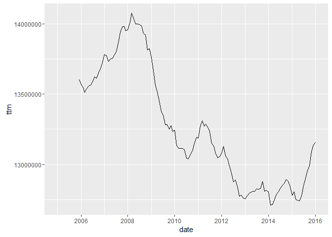
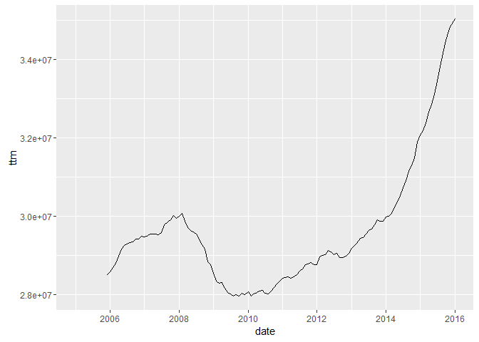
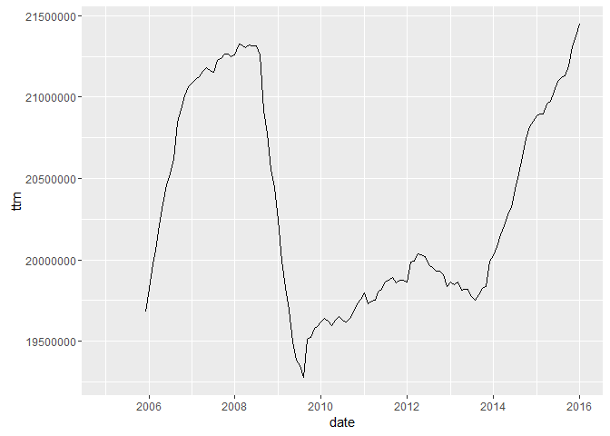
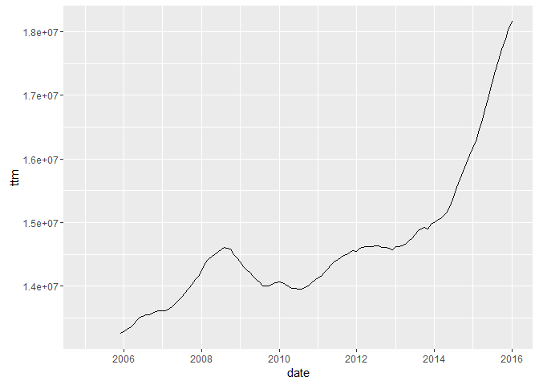
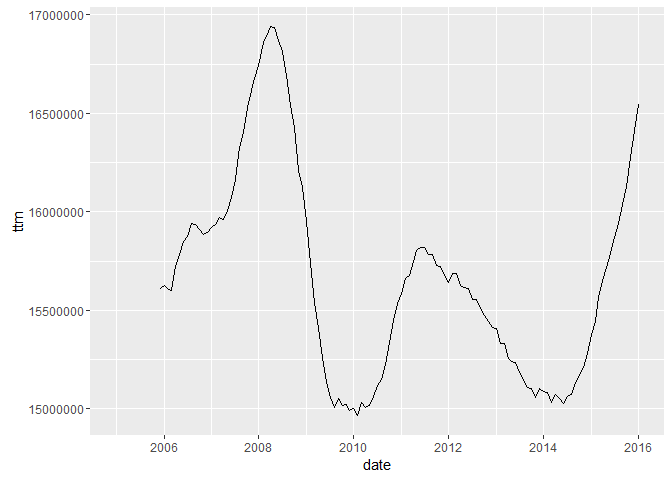
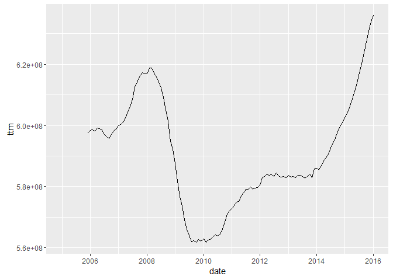

# Untitled
Tourism Economics  
April 15, 2016  


```r
library(arlodr)
library(zoo, warn.conflicts=FALSE)
library(xts, warn.conflicts=FALSE)
library(dplyr, warn.conflicts=FALSE)
library(tidyr, warn.conflicts=FALSE)
library(ggplot2, warn.conflicts=FALSE)
library(knitr)
library(readr)
```


```r
# load data
load("~/Project/R projects/bts_2016/output_data/hold_t100d_uscar.Rdata")

# for writing outputs
fpath <- c("~/Project/R projects/bts_2016/")
```


```r
data_work <- hold_t100d_uscar

temp_a <- data_work %>%
  gather(variable, value, -date, -area_sh, -area_name_simp, -flight_type, -carriers)

temp_b <- temp_a %>%
  arrange(area_sh, date) %>%
  dplyr::group_by(area_sh, flight_type, carriers) %>%
  # calculate trailing 12-month
  mutate(ttm=RcppRoll::roll_sumr(value, 12, fill=NA)) %>% 
  # calculate trailing 3-month
  mutate(t3m=RcppRoll::roll_sumr(value, 3, fill=NA)) %>%
  dplyr::ungroup() %>%
  dplyr::ungroup() %>%
  dplyr::ungroup() 

look <- temp_b %>%
  filter(area_sh == "phlpa")
ggplot(data=look, aes(x=date, y=ttm)) + 
  geom_line()
```

```
## Warning: Removed 11 rows containing missing values (geom_path).
```



```r
look <- temp_b %>%
  filter(area_sh == "dlltx")
ggplot(data=look, aes(x=date, y=ttm)) + 
  geom_line()
```

```
## Warning: Removed 11 rows containing missing values (geom_path).
```



```r
look <- temp_b %>%
  filter(area_sh == "hsttx")
ggplot(data=look, aes(x=date, y=ttm)) + 
  geom_line()
```

```
## Warning: Removed 11 rows containing missing values (geom_path).
```



```r
look <- temp_b %>%
  filter(area_sh == "sttwa")
ggplot(data=look, aes(x=date, y=ttm)) + 
  geom_line()
```

```
## Warning: Removed 11 rows containing missing values (geom_path).
```



```r
look <- temp_b %>%
  filter(area_sh == "orlfl")
ggplot(data=look, aes(x=date, y=ttm)) + 
  geom_line()
```

```
## Warning: Removed 11 rows containing missing values (geom_path).
```



```r
look <- temp_b %>%
  filter(area_sh == "usxxx")
ggplot(data=look, aes(x=date, y=ttm)) + 
  geom_line()
```

```
## Warning: Removed 11 rows containing missing values (geom_path).
```




```r
# tidy version
out_t100_tidy <- temp_b
# dates across top
out_t100_m <- temp_b  %>%
  gather(transf, value, -area_sh, -area_name_simp, -flight_type, -carriers, -variable, -date) %>%
  mutate(transf = gsub("value", "none", transf)) %>%
  tidyr::unite(var_fl_car, variable, flight_type, carriers, sep = "_", remove=TRUE) %>%
  spread(date, value)
```


```r
  # write output file
  write.csv(out_t100_m, file=paste0(fpath, "output_data/out_t100_m.csv"), row.names=FALSE)
  # save tidy version
  save(out_t100_tidy, file=paste0(fpath, "output_data/out_t100_tidy.Rdata"))
```


